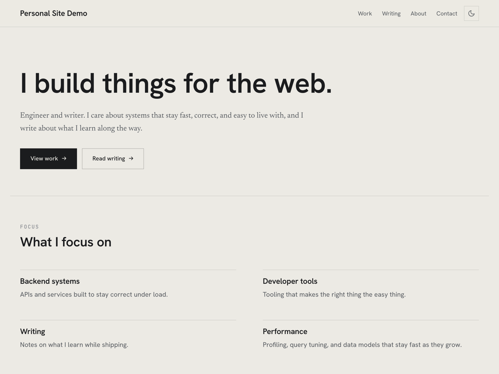

# Personal Site

A minimal, fast WordPress theme for a developer or writer's portfolio and blog. The CSS is a hand-written design system with no framework and no build step, so the whole look is driven by custom properties and easy to retheme from one place.




## Contents

- [Highlights](#highlights)
- [Requirements](#requirements)
- [Installation](#installation)
- [Configuration](#configuration)
- [The contact form](#the-contact-form)
- [Project structure](#project-structure)
- [Theming](#theming)
- [Releases and updates](#releases-and-updates)
- [License](#license)

## Highlights

**Hand-built CSS, no framework.** One stylesheet in `assets/css/main.css`, organized into tokens, reset, base, layout, components, prose, forms, and responsive sections. Every color, font, and spacing value comes from a CSS custom property, so there is nothing to compile and nothing to fight with.

**Dark mode that does not flash.** An inline boot script sets the theme before paint, a header toggle lets people switch, and `prefers-color-scheme` decides the default. The choice is remembered in `localStorage`.

**Editable homepage, built on blocks.** The landing page is assembled from native Gutenberg blocks (Hero, Focus, Selected Work, Recent Writing, and a call to action). They render server side, so there is no client bundle, and they stay editable in the block editor with their own inspector controls.

**Portfolio content type.** A `Portfolio` post type with a `project_type` taxonomy, an image gallery, and separate fields for a live URL and a source repository, so open source work can link to both.

**A secure contact form, no plugin.** Built into the theme with no third party dependency and no file uploads. It ships with a honeypot, a signed time trap, a same origin check, per IP rate limiting, and optional Cloudflare Turnstile. Submissions are stored in the admin under their own Contact menu, and an optional email notification can be turned on.

**SEO without a plugin.** Meta description, Open Graph, Twitter cards, and JSON-LD (`WebSite` and `Person` on the home page, `Article` and `BreadcrumbList` on posts). It steps aside automatically when Yoast, Rank Math, or SEOPress is active.

**A Theme Options panel.** Everything that should not live in a block lives under Appearance, Theme Options: social links, accent color, the About page (portrait, career timeline, freelance history, education), contact settings, and the footer.

**Accessible and responsive.** Skip link, visible focus rings, ARIA on interactive controls, reduced motion support, and a mobile friendly navigation.

## Requirements

- WordPress 6.5 or newer
- PHP 8.0 or newer

## Installation

1. Copy the `personal-site` folder into `wp-content/themes/`.
2. Open Appearance, Themes in the admin and activate **Personal Site**.
3. Portfolio permalinks are registered on activation. If a project returns a 404, open Settings, Permalinks and click Save once to flush the rewrite rules.

## Configuration

**Home page.** Under Settings, Reading, set *Your homepage displays* to a static page and pick a separate *Posts page* for the blog. Edit the static page in the block editor and add the homepage blocks (Hero, Focus, Selected Work, Recent Writing, CTA) in whatever order you like.

**Menus.** Create a menu under Appearance, Menus and assign it to the **Primary** location. A **Footer** location is also available for the footer links.

**Theme Options.** Under Appearance, Theme Options, set your social links and accent color, fill in the About page content, configure the contact form, and edit the footer text. The copyright field accepts `{year}` and `{name}` placeholders.

**About and Contact pages.** Create two pages and assign the **About** or **Contact** template in the page's Template selector.

**Projects.** Add entries under Portfolio. Set a featured image, an excerpt, a gallery, a live URL, an optional repository URL, and one or more project types.

## The contact form

The form is designed to stop spam and abuse without a plugin and without ever accepting an uploaded file. Each submission passes through several independent checks:

- A nonce tied to the session.
- A hidden honeypot field that real visitors never fill in.
- A signed time trap (an HMAC over the render time) that rejects instant submissions and stale forms.
- A same origin referer check that only blocks an explicit foreign host.
- Per IP rate limiting backed by transients.
- A link spam heuristic on the message body.
- Optional Cloudflare Turnstile, verified server side against the siteverify API.

To enable email notifications, turn the option on under Appearance, Theme Options, Contact, and set the destination address. WordPress sends mail through PHP `mail()` by default, so for reliable delivery, install an SMTP plugin and point it at your mail provider.

## Project structure

```
personal-site/
  style.css              Theme header (the visual CSS lives in assets/css/main.css)
  theme.json             Block editor settings and styles
  functions.php          Loads the includes below
  inc/
    options.php          Options schema, storage, getters, accent output
    setup.php            Theme supports, menus, image sizes
    enqueue.php          Styles, scripts, fonts, resource hints
    post-types.php       Portfolio post type, taxonomy, gallery, project links
    template-tags.php    Reusable template helpers and inline SVG icons
    blocks.php           Dynamic homepage blocks (server rendered)
    contact.php          Secure contact form and submission storage
    seo.php              Meta tags, Open Graph, and JSON-LD
    admin/
      theme-options.php  The Appearance, Theme Options admin page
  assets/
    css/main.css         The design system
    css/editor.css       Block editor styles
    css/admin-options.css Theme Options admin styles
    js/theme.js          Dark mode toggle and mobile navigation
    js/blocks.js         Block editor registration (vanilla, no JSX)
    js/admin-options.js  Tabs, media picker, repeaters
    js/admin-gallery.js  Portfolio gallery picker
  template-parts/        post-card, post-row, portfolio-card, content-none
  *.php                  Page templates (front-page, single, archive, 404, search, and more)
```

## Theming

Change the look from one place. In `assets/css/main.css`, the `:root` block holds the light palette and `[data-theme="dark"]` holds the dark overrides. Adjust the color, type, and spacing tokens and the rest of the theme follows. For a quick accent change, you can also set the accent color under Appearance, Theme Options without touching CSS.

## Releases and updates

The theme updates itself from GitHub Releases, with no plugin and no third party library. There are two parts:

**Building a release.** A GitHub Actions workflow (`.github/workflows/release.yml`) runs when you push a version tag. It packages the theme into a clean `personal-site.zip` (with the correct inner folder name and dev files stripped out) and attaches it to the matching GitHub Release. The workflow uses only GitHub's own tooling, no marketplace actions.

To cut a release:

1. Bump `Version:` in `style.css` (and the `PERSONAL_SITE_VERSION` constant in `functions.php`).
2. Commit, then tag and push:
   ```bash
   git tag v1.0.1
   git push origin v1.0.1
   ```

The workflow checks that the tag matches the `Version:` header, builds the zip, and publishes the release.

**Receiving updates.** A small updater in `inc/updater.php` reads the latest release through the GitHub API, compares it to the installed version, and feeds WordPress the normal update notice. When a newer release exists, the site shows it under Dashboard, Updates and Appearance, Themes, and the one click Update installs the release zip. The lookup is cached for twelve hours, so a site contacts GitHub at most twice a day. The repository is public, so no token is required.

## License

GPL v2 or later. This theme, like WordPress itself, is free software.
